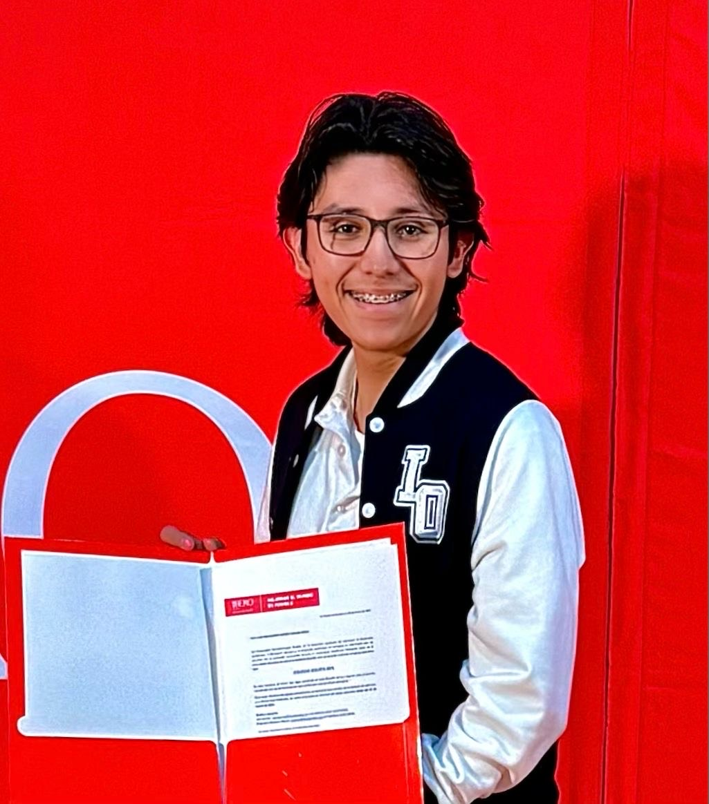

# PRESENTACIÓN

## Diego Machorro Lucero

# ¿Quién soy? 
Mi nombre es Diego Machorro Lucero, actualmente me encuentro estudiando la carrera de ingeniería mectrónica. Me considero un buen estudiante puesto que hasta el momento un logro que he conseguido es la beca de 60% en la universidad donde estoy estudiando, ya que he mantenido un promedio de 0.2 en el bachillerato.

# Intereses

- Videojuegos
- Física
- Los animales

# Información de contacto

Correo: 203588@iberopuebla.mx
Teléfono cleular: 6188069822
 

## Raul Everardo Zarate Ramirez

# ¿Quién soy?
Soy Raul Everardo Zarate Ramirez, tengo 18 años y actualmente estoy estudiando ingeniería mecatrónica en la universidad Iberoamericana de Puebla, me considero una gran persona, 
parte importante para las personas a mi alrededor, puesto que soy buen apoyo emocional.

# Intereses

- Videojuegos
- Dormir
- Los deportes

# Información de contacto

Correo: 203352@iberopuebla.mx
Teléfono celular: 2229060329

