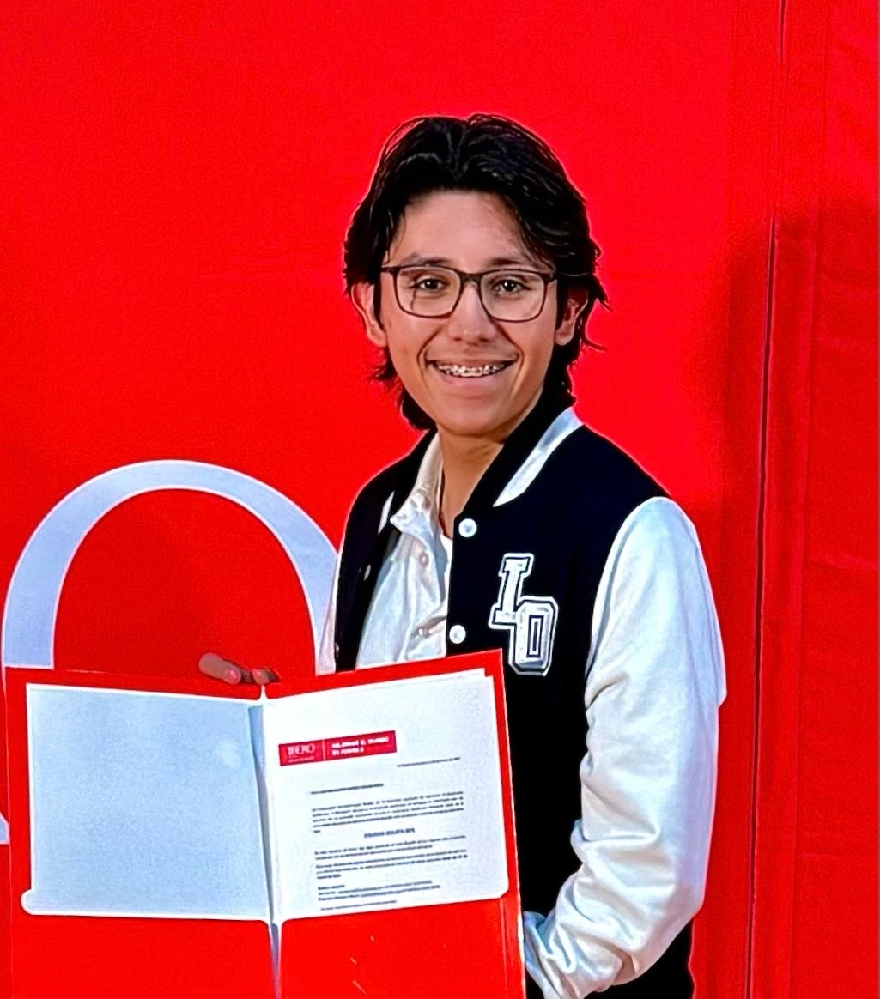

# Documentación del Proyecto de Diego y Raul 42

## Diego Machorro Lucero
Buen razonamiento matemático, gusto por los videojuegos, la física, las ciencias  y los animales. Buen promedio en el bachillerato.




## Raul Everardo Zarate Ramirez
Gusto por los videojuegos, dormir, y habilidades sociales destacables. 
Ser una parte importante para las personas a mi alrededor, puesto que soy buen apoyo emocional.


Bienvenido 👋  
Esta es una **plantilla** basada en [MkDocs](https://www.mkdocs.org/) + [Material for MkDocs](https://squidfunk.github.io/mkdocs-material/) para cursos y proyectos.

---

## Empezar rápido (3 pasos)

1. **Edita el nombre del sitio** en `mkdocs.yml`:
   ```yaml
   site_name: Documentación del Curso
   theme:
     name: material
